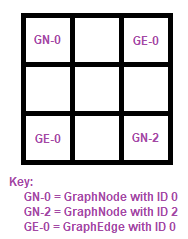

## Tasks
[back](README.md)

There are **5** tasks in this assignment. It is suggested that you implement these tasks in the given order. 

### Task 1: Examine the JCF Classes (0%)

Read and familiarize yourself with the JCF classes. You may use these classes if you wish (or you are welcome to reuse your previous project code, or "roll your own" versions of these classes). Below is an overview of the most likely classes to be helpful in this assignment:

1. [ArrayList](https://docs.oracle.com/javase/8/docs/api/java/util/ArrayList.html) - Java's dynamic array list class
2. [HashMap](https://docs.oracle.com/javase/8/docs/api/java/util/HashMap.html) - Java's map class supported by a hash table
3. [Collection](https://docs.oracle.com/javase/8/docs/api/java/util/Collection.html) - All JCF classes implement this generic interface.

Where should you start? The Java Tutorials of course! (If you didn't know, Oracle's official Java documentation includes a set of tutorials.) The [Trail: Collections](https://docs.oracle.com/javase/tutorial/collections/) tutorial will provide you with more than enough information on how to use these classes.

### Task 2: Read the Provided Code Base (0%)

Read and familiarize yourself with the code. This will save you a lot of time later. An overview of the provided code in is given below, but you need to read the code base yourself.

```java

//This class is the parent class of all graph components.
//It is provided and should not be altered.
class GraphComp {...}

//This class represents a node in a graph.
//It is provided and should not be altered.
class GraphNode {...}

//This class represents an edge in a graph.
//It is provided and should not be altered.
class GraphEdge {...}

//This class represents an undirected graph.
//You will write 99% of this class, but a template is provided.
class ThreeTenGraph implements Graph<GraphNode,GraphEdge>, UnirectedGraph<GraphNode,GraphEdge> {...}

//This is the Priority Queue code from your textbook. It’s complete,
//but for Prim's Minimum Spanning Tree Algorithm it will need some work
//(done by you).
class WeissPriorityQueue {...}

//These are part of the textbook library and support the Weiss
//PriorityQueue. They are complete.
class WeissCollection {...}
class WeissAbstractCollection {...}

//This interface defines an algorithm that can be simulated with the GUI
interface ThreeTenAlg {...}

//You will be writing this algorithm (Prim's Minimum Spanning Tree)
class ThreeTenPrim implements ThreeTenAlg {...}

//This is the simulator and handles all the graphical stuff, it is provided.
class SimGUI {...}

```

You are required to complete the JavaDocs and adhere to the style checker as you have been for all previous projects. The checkstyle.jar and associated .xml files are the same as on previous projects. You need to correct/edit the provided style and/or JavaDocs for some classes because the Weiss and JUNG library comments don't quite adhere to the style requirements for this class. Updating/correcting another coder’s style is a normal process when integrating code from other libraries – so this is boring but necessary practice for the “real world”.

It is HIGHLY RECOMMENDED that you write your JavaDocs for this project during this stage. That way you will have a full understanding of the code base as you work. Don’t overdo it! Remember you can use the inheritdoc comments for inheriting documentation from interfaces and parent classes!

### Task 3: Implement an Undirected Graph Class to Support the Simulator (60%)

In order for the simulator to work, you need an internal representation of a graph. The JUNG library provides an interfaces for this: `Graph<V,E>`. You need to implement the undirected graph `ThreeTenGraph` (in `ThreeTenGraph.java`) which implements the `Graph<GraphNode,GraphEdge>` interface.

The method of storage we are going to use is a little different than the ones we've shown in class. It is an adjacency matrix, but with the following changes:

1. The graph storage will be a 2D array of GraphComp objects, rather than a 2D int array.
2. The graph must be able to store GraphNode objects (one per vertex in the graph). To do this you will use the diagonal space, and self-loops will not be permitted. Every GraphNode has an ID property and we promise that we will never create or consider a graph with IDs below 0 or above 199 (but ID 199 _is_ possible).
3. The graph must be able to store GraphEdge objects (one per edge). These will be stored instead of weights in the appropriate places for an edge. The GraphEdge class has a weight property.

An concept image of the graph storage with two vertices (ID 0 and 2) and one edge (ID 0) is shown below. The vertex with ID 1 is not in the table and therefore not in the graph. Remember that all graph components have IDs, and so edges have IDs too (and those IDs do not relate in any way to what vertices they connect, the placement in the adjacency matrix gives you that information).



Once you understand how the storage should work, you will need to implement several support methods for the graph visualization. Below is a quick overview of the methods you need to support. Note that in the template, actual JavaDoc comments are provided. That said, the JavaDocs are those from the `Graph<>` interface and the `HyperGraph<>` interface in JUNG. They have been copied from that library for your reference, but are otherwise unaltered. Part of this assignment is to practice reading "real" documentation and understanding what to implement based on the library's requirements.

```java

//********************************
// Graph Editing (~20%)
//********************************

boolean addEdge(GraphEdge e, GraphNode v1, GraphNode v2 {...}
boolean addVertex(GraphNode vertex) {...}

boolean removeEdge(GraphEdge edge) {...}
boolean removeVertex(GraphNode vertex) {...}


//********************************
// Graph Information (~40%)
//********************************

//For a given graph...

Collection<GraphEdge> getEdges() {...}
Collection<GraphNode> getVertices()  {...}

int getEdgeCount() {...}
int getVertexCount() {...}

String depthFirstTraversal(GraphNode curr, boolean[] visited, boolean restart) {...}


//For a given vertex in a graph...

boolean containsVertex(GraphNode vertex) {...}
Collection<GraphEdge> getIncidentEdges(GraphNode vertex) {...}

Collection<GraphNode> getNeighbors(GraphNode vertex) {...}
int getNeighborCount(GraphNode vertex) {...}


//Given two vertices in a graph...

E findEdge(GraphNode v1, GraphNode v2) {...}


//Given an edge in a graph...

Pair<GraphNode> getEndpoints(GraphEdge edge) {...}


//Given a vertex and an edge in a graph...

boolean isIncident(GraphNode vertex, GraphEdge edge) {...}
 
```

When you are done with this step, you can generate and play with some graphs in the simulator (see the [Examples Page](EXAMPLES.md "")).

_Hints and Notes_
- Read ALL the methods before you decide how to implement any methods, you may need/want to reuse code from some methods in implementing others.
- Note that we cannot test editing a graph or getting information about a graph independently of each other. So you cannot get points for completing only the graph editing or only the graph information parts of this interface, you need everything...

### Task 4: Implement an Efficient Update Mechanism for a Heap Class (30%)

The graph simulator is going to run Prim's Minimum Spanning Tree Algorithm, but this requires a priority queue with the ability to update the priority of individual items. If you look at your textbook, it gives information in Chapter 21 (section 4) about the "decrease key" operation. We want a similar update() operation which increases (or decreases) the priority of the item. The item (or an equal item) will be provided and it should update the priority queue appropriately.

The only way to do this efficiently is to use a map to map heap items to indexes so that you know where to start the update (in average case O(1) time). Without this, update() would be O(n) and not O(lg n). Therefore before you implement updating, you need to integrate a map into the Weiss code. Whenever an item is placed, moved, or removed from the heap, the map should updated to reflect the item's new index (or remove it from the map in the case of removal from the heap). You are welcome to use the JCF HashMap class for this, or you may use your HashTable implementation from Project 3 (your choice).

### Task 5: Implement Prim's Minimum Spanning Tree Algorithm in the Simulator (10%)

Now for the fun part! The simulator need to know what one "step" of Prim's Algorithm looks like. `ThreeTenPrim` (in `ThreeTenPrim.java`) will provide the steps for the algorithm, and it's mostly written, but there are some key pieces missing! You're going to "fill in the blanks" to get it working.

An overview of some key parts of `ThreeTenPrim` class is given below to get you started:

```java
//this is the actual "step" method, which calls other methods you will be finishing up...
boolean step() {
	if(!started) {
		start();
		return true;
	}
	
	cleanUpLastStep();
	if(!setupNextMin()) {
		finish();
		return false;
	}
	doUpdates();
	
	return true;
}

//this does most of the setup for Prim's algorithm
void start() {...}

//performs any "clean up" in preparation for performing another step of the algorithm
void cleanUpLastStep() {...}

//pick the next minimum node to look at for the algorithm and updates the graph accordingly
boolean setupNextMin() {...}

//does the neighbor updates from Prim's Algorithm
void doUpdates() {...}

//cleans up after the algorithm finishes
void finish() {...}

```

When you are done with this step, you can play the algorithm in the simulator (see the [Examples Page](EXAMPLES.md "")).

_Hints and Notes_
- You are not responsible for making the algorithm work if the user edits the graph while Prim's Algorithm is running. Just assume all editing will take place before hitting "step" or "play" and that, if they want to do the algorithm again, they will hit "reset" and generate a new graph.

### Examples for Testing

`WeissPriorityQueue` and `ThreeTenGraph` have main methods for testing. You should thoroughly test these classes before trying to run the simulator. If you see errors/weird things in the simulator it means something is wrong in YOUR code. All the simulator does is call your methods! For example:

Issue:
- You delete a node, but there are still edges appearing “in the air” on the simulator which should have been removed.

Possible Causes:
- Your removeVertex() method might not be working properly.
- Your getEdges() or getEdgeCount() methods might not be working properly. Your map storage class might not be working properly.

Definitely NOT the Cause:
- The simulator is broken.

How do you diagnose the problems?
- Debugger, breakpoints, print statements...